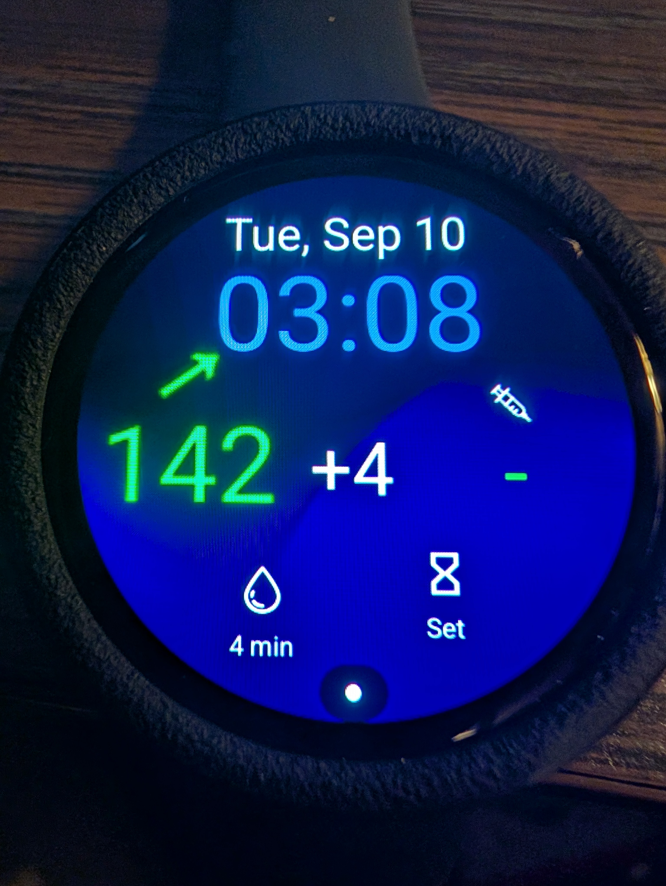

Diabetic Oversized Watch Face Created with Samsung Watch Face Studio that are Compatible with Wear OS 5+ using GlucodataHandler for the Visually Impaired

File DMM1.wfs was created with WatchFaceStudio_1.6.10.exe on Windows 11.  

Pixel Watch 3 44mm

Galaxy Watch 7 44mm

Oversized watch face for MDI Injections with extra large complications for better viewing experience for the visually impaired for Dexcom G7, xdrip+ companion for the Galaxy watch 7 or Pixel Watch 3,using very specific Complications from glucodata handler app on phone and watch. Installing the watch face on wear os 5 is a bit complicated, and you have to use WatchFaceStudio_1.6.10 program. You Load the file and send it to watch via ADB using the Function "Run on Watch" in the Watchfacestudio App. Detailed install instrucions below. This watch face complications uses very specific glucodataandler customization. Warning !! Other customizations will NOT look right and the font will be tiny or oversized. Also when touching the watch face, it brings me to alarms and I don't know how to fix that or make it go somewhere else. 

From the top left Complication going accross using Glucodatahandler specific Customizations are as follows. 
1. Glucose and Trend (big and colored),
2. Delta big,
3. IOB
4. Glucose time stamp
5. Samsung Timer 

Install Process

Step 1. Connect your watch and computer to the same Wi-Fi network 

Step 2. Enable Developer Options on Watch
go to Settings > About device > Software info, then tap the Build number until “Developer options enabled” appears on the screen. 
Go back and select Developer Options at the bottom of /settings

Step 3. Put you watch on a usb charger and open Developer Options
    select “Stay awake when charging”
    select “ADB Debugging”
    select “wireless debugging then check wireless debugging in enabled,

on the next screen, Now ensure wifi address is the same on both computer and watch, scroll down and select Allow. 
It will bring you back to the previous screen. 

Step 4. Now go to Samsung Watch Face Studio on PC load the file DMM1.WFS then select “Run on Device” 
    Click + next to (scan devices)
    Add your ip address from your watch (example 192.168.1.106)
    Then add port number that is after your ip: (example 34669)
    Then click + on the watch to (Pair new device)
    Add Pairing code from watch to pairing code empty slot in watch face studio.
    Then Add Pairing Port Number from ip address at the bottom after Example (192.168.1.106:36749) then enter (36749)

Then select ok in watch face studio and the face will apear on your watch in about 14 seconds. Watch will dissconnect after the file is sent. If you 
want to send another file, you will have to pair again. I'm guessing, there is some kind of (build in) ADB timeout build into wear os5 that will stop the connection. 

Come Check out My Youtube channel for other Watch Faces Setups I've used with Basic Installation help. 

Diabetic Masked Man Channel Here:
https://www.youtube.com/channel/UCF-M5IItLP5aJpMiBQtmQKw

Good Luck.

